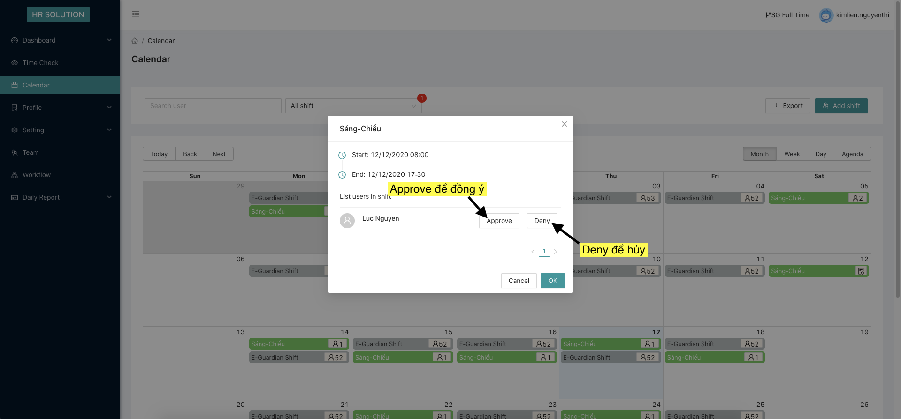

## Đăng ký ca làm việc cho tài khoản Part-time
Ở màn hình chính chọn vào mục Calendar

Chọn vào ngày muốn đăng ký, giữ chuột kéo thả để chọn nhiều ngày hoặc chọn trên thanh Date Range

Chọn ca làm việc và nhấn Submit

Màn hình sau khi đăng ký thành công

## Duyệt ca làm việc cho tài khoản Manager
Ở màn hình chính chọn vào mục Calendar, chọn vào lọc theo ca và chọn các ca chưa được duyệt

Nhấn vào button approve all để duyệt hết tất cả hoặc click vào từng ca để xem chi tiết

màn hình chi tiết ca làm việc, chọn approve để duyệt cho user hoặc deny để huỷ

Màn hình sau khi duyệt thành công
