## Try cập
Từ Hrsol click vào workflow trên menu 
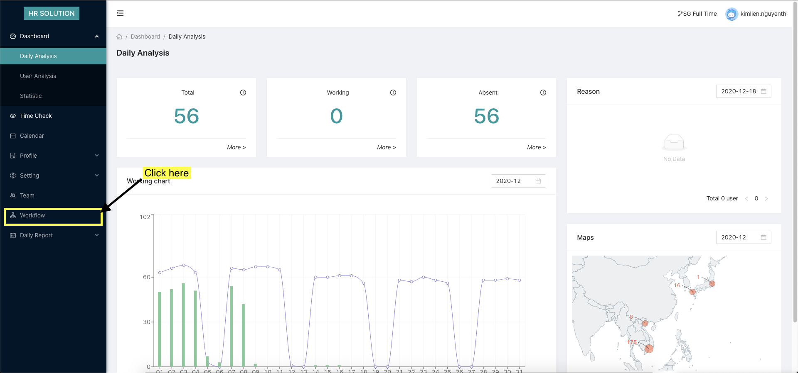

Màn hình đăng nhập
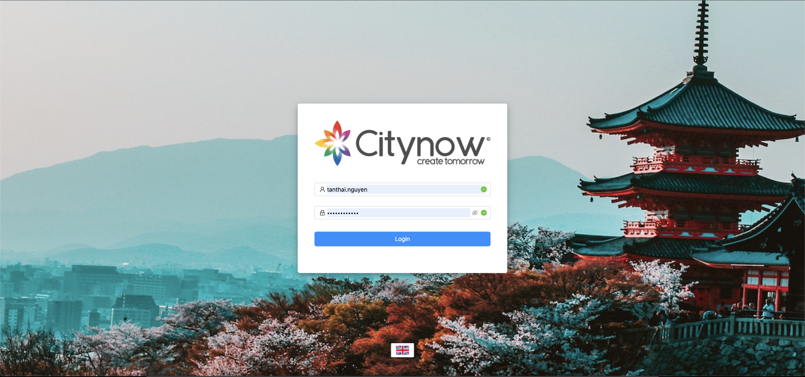

Màn hình chọn nhánh
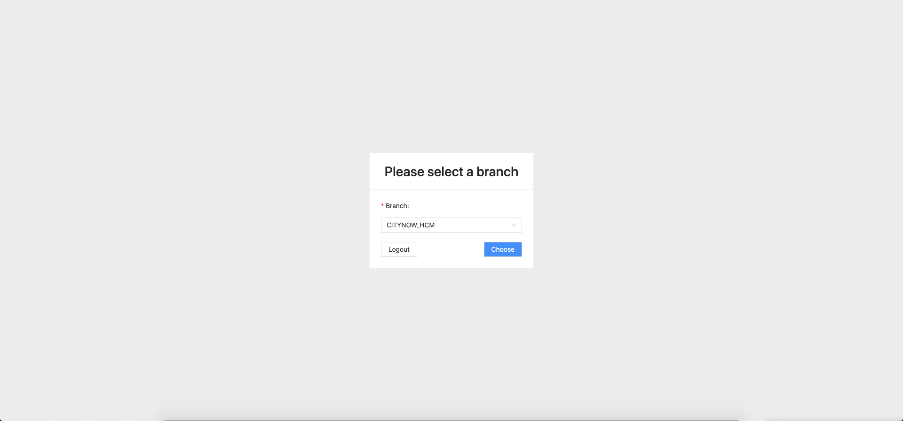
## Tạo request
Chọn vào mục Create request và điền đủ thông tin
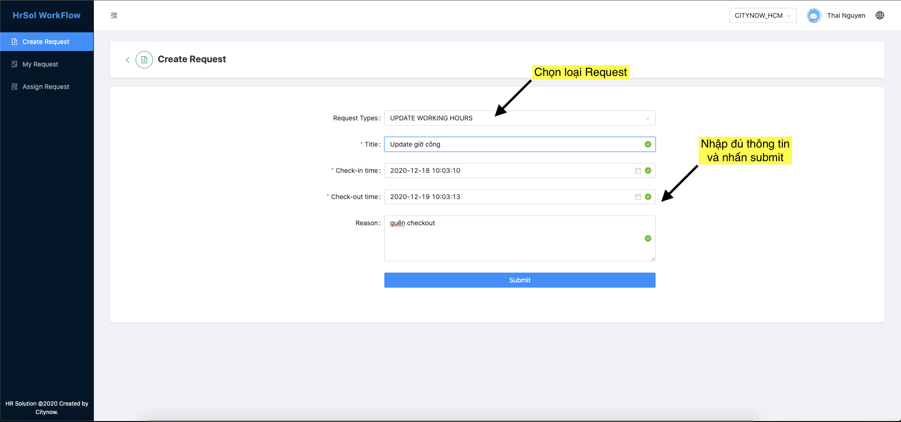

Màn hình sau khi tạo request thành công
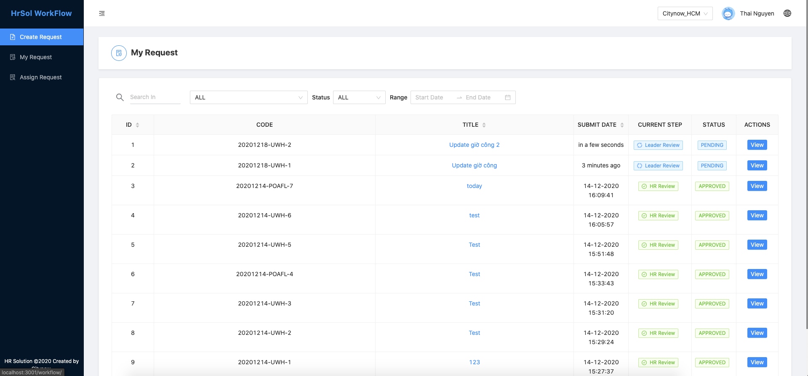

## Xem chi tiết request
Chọn vào nút view để xem chi tiết request
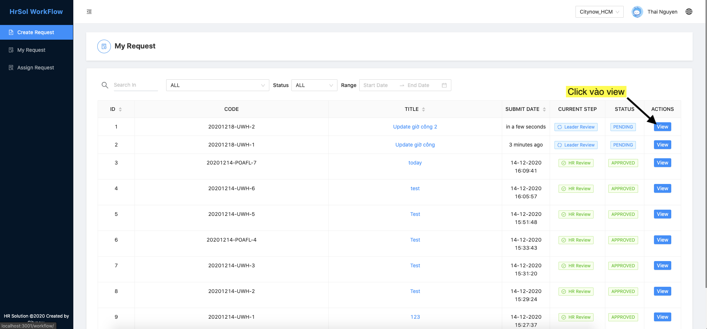

Giao diện xem chi tiết request. Ở bước khởi tạo đầu tiên, nếu chưa được duyệt thì người dùng có thể sửa và xoá request.
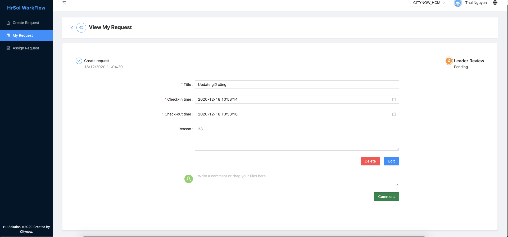

## Duyệt request (áp dụng cho tài khoản có role leader)
Vào mục Assign request và chọn vào request muốn duyệt
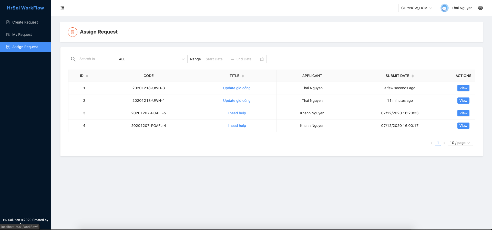

Review lại request. Nhấn Approve để duyệt, hoặc Decline để từ chối, hoặc comment nếu như có góp ý vào request
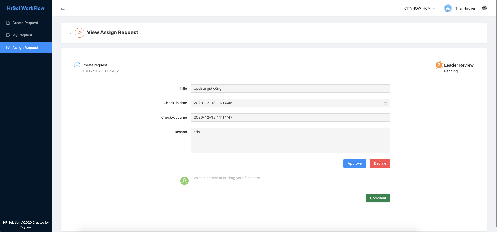

Giao diện sau khi comment
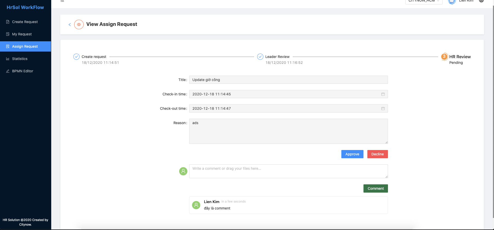

## Statistic (áp dụng cho các tài khoản có quyền truy cập)
Giao diện trang statistic, thống kê tất cả các request đã được tạo.
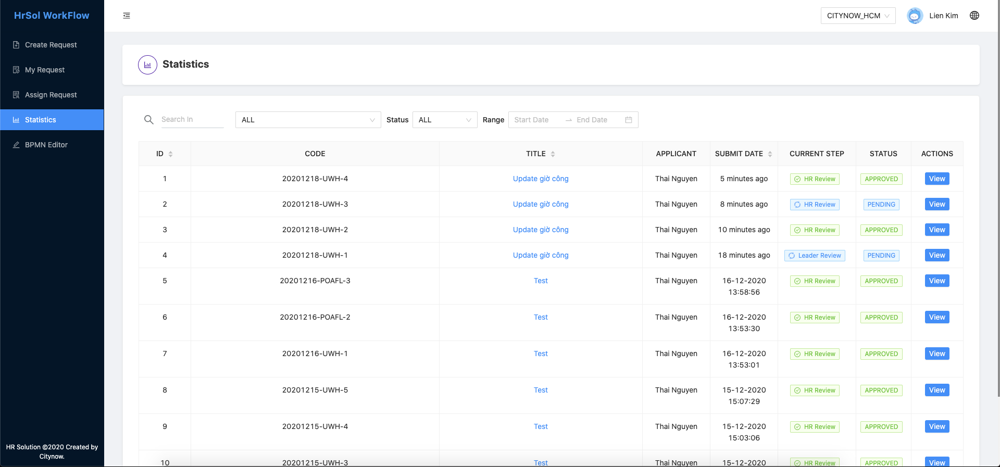

Giao diện xem chi tiết request, có thể xem các step, không có quyền sửa, xoá, comment.
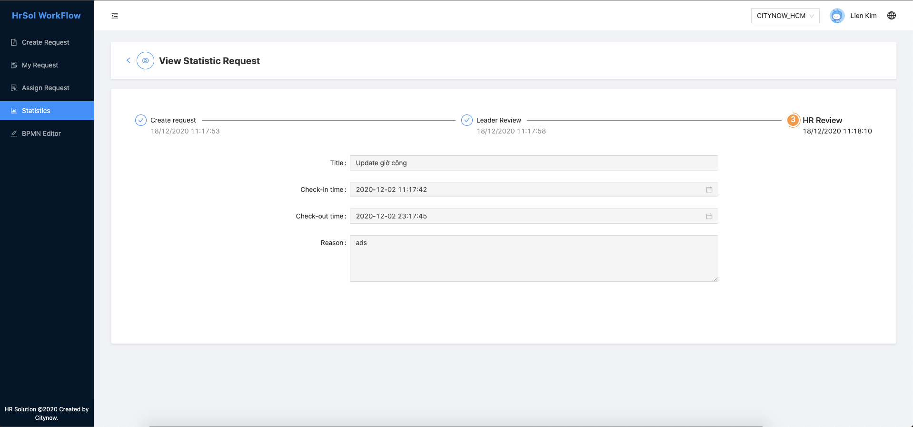

## BPBM Editor (áp dụng cho các tài khoản có quyền truy cập)
Giao diện trang BPMN Editor, người dùng có thể vẽ quy trình mới
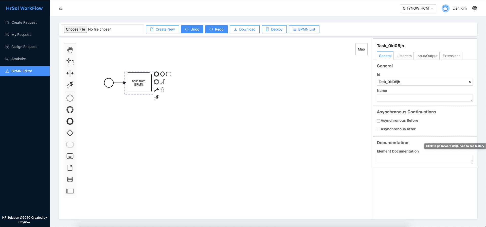

Sau khi vẽ xong nhấn vào deploy để đưa quy trình vào hoạt động
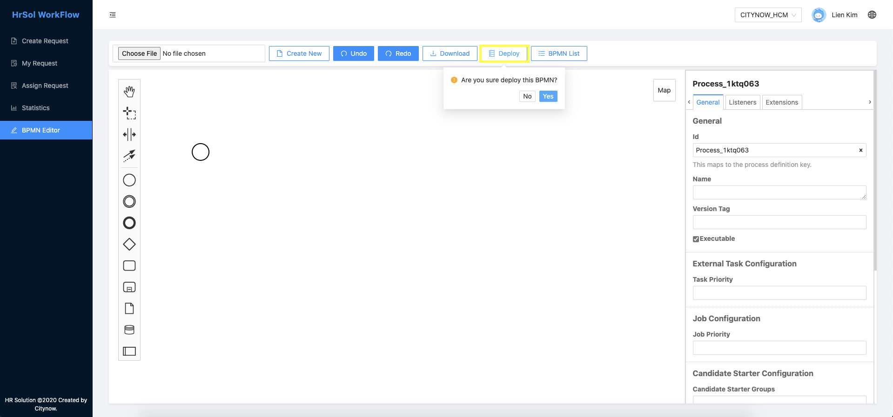

Xem lại tất cả các quy trình đã deploy bằng cách nhấn vào button BPMN List
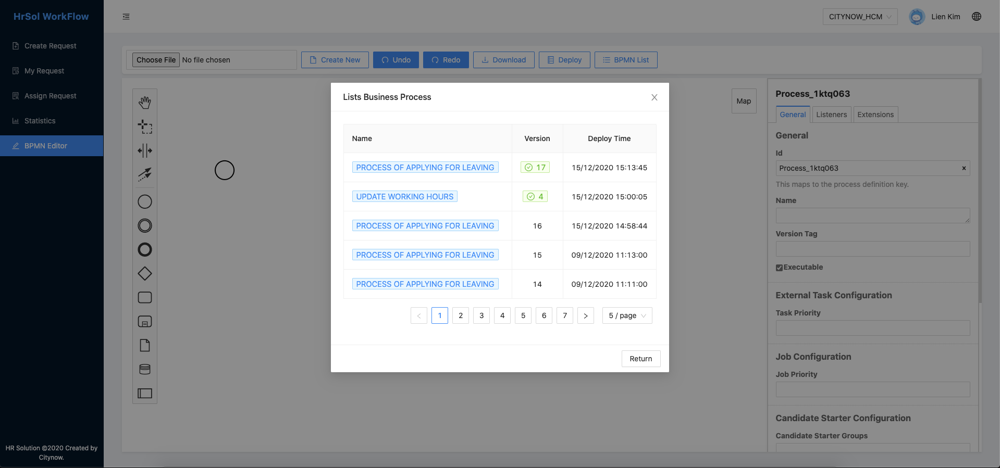

